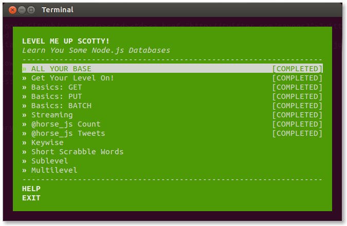
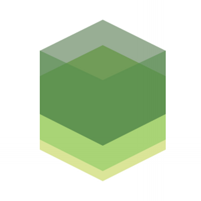

class: center, middle


# NodeSchool - *levelmeup*

http://goo.gl/Mt4FO8


[nodeschool.io/silesia](http://nodeschool.io/silesia), [@nodeschoolpl](https://twitter.com/nodeschoolpl)

[@rspective](https://twitter.com/nodeschoolpl)

[](http://blog.rspective.com)

???

- Witam w grupie, która zajmować się będzie nauką obsłgi bazy danych LevelDB.
- Korzystać będziemy z warsztatu *levelmeup*.

---

# Let's start!

1. [https://nodejs.org](https://nodejs.org)
2. `node -v`
3. `npm -v`
4. `(sudo) npm install -g levelmeup`
5. `levelmeup`

???

- Oto kilka kroków jakie należy wykonać, aby zainstalować warsztat.

---

# Workshopper



???

- Oto jak wygląda ekran startowy, tuż po otwarciu warsztatu.
- Poruszamy się za pomocą kursorów, ENTER wybiera aktywną lekcję.
- Do każdego ćwiczenia dołączony jest opis zadania wraz z krótkim wprowadzeniem.

---

# LevelDB

1. LevelDB to prosta, open-source-owa baza typu klucz wartość zbudowana przez Google.
2. Jest używana m.in. w Chromie (IndexedDB) oraz innych produktach (Bitcoin).
3. Zapisuje posortowane po kluczach dane na dysku.
4. Kompresuje dane używając szybkiego algorytmu Snappy.
5. Wspiera:
   - tablice byte-ów jako klucze i wartości,
   - operacje GET, PUT, DELETE,
   - batchowe operacje PUT, DELETE,
   - dwukierunkowe iterowanie.
6. Minusy:
   - nie jest to baza SQL,
   - tylko jeden proces może mieć do niej dostęp naraz,
   - nie ma wsparcia dla modelu client-server.

https://github.com/google/leveldb

http://leveldb.org



???

3) Można dostarczyć customową funkcję sortującą.

6) Nie wspiera relacji. Nie wpiera zapytań SQL.

6) Dostęp do bazy może mieć tylko jedna instancja w klastrze Node-a.

6) Nie możemy jej wystawić jako serwer bez własnego wrappera.

---

# LevelUP

1. LevelUP to wrapper LevelDB dla Node.js.
2. Callbacki + iteratory jako stream-y.
3. Wspiera m.in. takie encodowania jak Buffer i JSON.
4. Posiada dużo wtyczek. Wait for it...

https://github.com/rvagg/node-levelup

```javascript
var levelup = require('levelup');
var db = levelup('./mydb');
// anync; options: db, key/valueEncoding

// sync (+ as option); options: key/valueEncoding
db.put('name', 'LevelUP', function (err) {
  if (err) return console.error('Ooops!', err);

  // err.type === 'NotFoundError'  ||  err.notFound
  db.get('name', function (err, value) {
    if (err) return console.error('Ooops!', err);

    console.log('name=' + value);
  });
});
```

???

- options: createIfMissing (true), errorIfExists (false), compression (true), cacheSize (8 \* 1024 \* 1024), keyEncoding, valueEncoding ('utf8'), db (LevelDOWN)
- encodings: hex, utf8, ascii, binary, base64, ucs2, utf16le, json

---

# LevelDOWN and others...

1. LevelDOWN to bindowanie pomiędzy LevelUP a LevelDB.
2. Zaczynając od wersji 0.9, LevelUP nie dostarcza już LevelDOWN poprzez swoje zależności.
3. Programista musi sam je dostarczyć, lub jakąś alternatywę.
4. Przykładowe alternatywy: level.js, MemDOWN, MongoDOWN, RedisDOWN, localstorage-down.
4. Level = LevelUp + LevelDOWN

https://github.com/rvagg/node-leveldown

https://github.com/level/level

???

1) LevelUP używa LevelDOWN aby wykonywać operacje na LevelDB.

4) Level powstał głównie aby ułatwić używanie LevelDB.

4) Tworzą go prawie ci sami ludzie. Level ma o jednego kontrybutora mniej.

---

# Code snippets: batch ops

```javascript
var ops = [
    { type: 'del', key: 'old' },
    { type: 'put', key: 'new', value: 'Clown' } // options: key/valueEncoding
];

db.batch(ops, function (err) {
  if (err) return console.log('Ooops!', err);
  console.log('Success!');
});
```

```javascript
db.batch()
  .del('old')
  .put('new', 'Clown') // options: key/valueEncoding
  .write(function(err) {
     if (err) return console.log('Ooops!', err);
     console.log('Success!');
   });
```

???

- clear() - czyści wcześnejsze komendy

---

# Code snippets: streams

```javascript
db.createReadStream() // createKeyStream, createValueStream; options
  .on('data', function(data) {
    console.log(data.key, '=', data.value);
  })
  .on('error', function(err) {
    console.error('Ooops!', err);
  })
  .on('close', function() {
    console.log('Stream closed');
  })
  .on('end', function() {
    console.log('Stream closed');
  });

// options: gt (start), lt (end), reverse, limit
// options: keys, values, key/valueEncoding
```

???

- pause(), resume(), destroy(), pipe()
- nie ma createWriteStream() - oddzielny moduł
- options: reverse (false), limit (-1, all), keys (true), values (true), ... fillCache (false)

---

# Links

1. https://github.com/rvagg/node-levelup - dokumentacja
2. https://github.com/rvagg/node-levelup/wiki/Modules - o_O

   ... databases, ORMs, Storage back-ends, Plugins, Replication, Modules, write-streams, Tools (GUI)

???

- Czego nie było:
- Events
- db.db.approximateSize
- db.db.getProperty(): 'leveldb.num-files-at-levelN', 'leveldb.stats', 'leveldb.sstables'
- leveldown.destroy(), leveldown.repair()

---
class: center, middle

# Let's get the fingers *busy* !

hint: debug = console.error() + 'levelmeup run file.js'