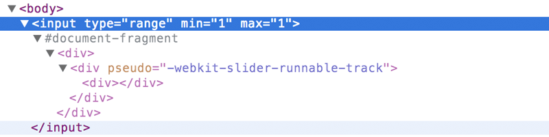

class: center, middle


# NodeSchool
# *Web Components and Polymer*

http://goo.gl/Mt4FO8


[nodeschool.io/silesia](http://nodeschool.io/silesia), [@nodeschoolpl](https://twitter.com/nodeschoolpl)

[@rspective](https://twitter.com/nodeschoolpl)

[](http://blog.rspective.com)

---

# Web Components - the Web SDK

- Custom elements
```
<my-tag></my-tag>
```
- Imports
```
<link rel="import" href="my-tags.html">
```
- Shadow DOM/CSS

- Templates
```
< template >
       // this will not fire any request (yet)
< /template >
```

---

# Polyfills

- "A polyfill, or polyfiller, is a piece of code (or plugin) that provides the technology that you, the developer, expect the browser to provide natively. Flattening the API landscape if you will."
- https://github.com/webcomponents/webcomponentsjs

---

# Polymer


- "Built atop these new standards, Polymer makes it easier and faster to create anything from a button to a complete application across desktop, mobile, and beyond."
- https://www.polymer-project.org/0.5/
- core and paper elements
 - https://www.polymer-project.org/0.5/docs/elements/
- https://www.polymer-project.org/0.9/
 - 14-05-2015
- alternatywy
 - http://www.x-tags.org/
 - https://bosonic.github.io/

---

# Ready components

- http://component.kitchen/
- https://customelements.io/
- https://googlewebcomponents.github.io/

---

# Other interesing...

- web animations
 - https://web-animations.github.io/web-animations-demos
- http://builtwithpolymer.org/
- http://developer.telerik.com/featured/web-components-arent-ready-production-yet/

---

<great-thanks/>